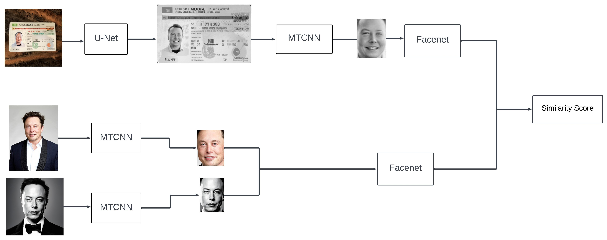

# Identity Document Verification

An end-to-end pipeline (see image below) for verifying ownership of identity documents.

The verification pipeline works by comparing the image on an identity document with one or two images collected from the supposed owner of the ID. The ID image is then compared with the collected images to see if they're similar.

This is a few-shot learning task that leverages embeddings to verify similarity. The embeddings are generated with an Inception model and the similarity is computed using the cosine distance: $1 - (u * v)/ \lVert u \rVert * \lVert v \rVert$. 

It is recommended to use more images (two works fine) taken at different angles to generate a richer set of embeddings.



## Pipeline
Here are the components of the pipeline:
### Semantic Segmentation
The ID document pipeline starts at the semantic segmentation step. This step segments (using a U-Net model) and crops the ID card in the image and then using
classic computer vision techniques, performs a perspective transformation to ensure that the ID document is well aligned for facial detection.

### Facial Detection
Facial Detection is handled by a multi-task CNN (MTCNN) for face detection. The facial detection step is applied to the output of the segmentation step on the ID card and on the raw images collected of the users.

You can read more about the model [here](https://kpzhang93.github.io/MTCNN_face_detection_alignment/index.html)

### Encoding
The encoding step is handled by a model using the InceptionResnetV2 architecture with the facenet weights. This model is used to generate embeddings (a rich set of vectors that capture facial features) for both the face on the ID document and the faces collected for verification. The cosine distance between both embeddings are generated using the formula above and a similarity score is then computed from this distance.

The formula for the similarity score is: $1 - cosine_distance$. The higher the score, the more similar the images are. Similarity scores less than 0 imply that there's extremely little similarity between the faces being verified. A default value of 0.5 is used as the threshold for faces to be considered similar. This can be changed depending on your levels of strictness but 0.5 works pretty well.


## Example Usage
Run ```python main.py -r <path-to-id-image> -c <path-to-collected-images> -t <threshold-value>(optional)``` to perform verification.


For example, when I ran the verification script with the images in the example folder, I get the following results:
```
$ python main.py -r realistic_musk.png -c real_musk.jpeg real_musk.png -t 0.6
2023-05-27 02:02:30.686573: I tensorflow/core/platform/cpu_feature_guard.cc:182] This TensorFlow binary is optimized to use available CPU instructions in performance-critical operations.
To enable the following instructions: AVX2 FMA, in other operations, rebuild TensorFlow with the appropriate compiler flags.
INFO:root:Entrypoint for ID Verification Code...
INFO:root:Loading U-Net model...
INFO:root:Done.
INFO:root:Loading Facenet model...
INFO:root:Done.
INFO:root:Processing....
1/1 [==============================] - 1s 648ms/step
1/1 [==============================] - 0s 147ms/step
1/1 [==============================] - 0s 124ms/step
1/1 [==============================] - 0s 36ms/step
1/1 [==============================] - 0s 31ms/step
1/1 [==============================] - 0s 28ms/step
1/1 [==============================] - 0s 26ms/step
1/1 [==============================] - 0s 28ms/step
1/1 [==============================] - 0s 25ms/step
1/1 [==============================] - 0s 26ms/step
1/1 [==============================] - 0s 26ms/step
2/2 [==============================] - 0s 11ms/step
1/1 [==============================] - 0s 153ms/step
1/1 [==============================] - 2s 2s/step
1/1 [==============================] - 0s 379ms/step
1/1 [==============================] - 0s 162ms/step
1/1 [==============================] - 0s 89ms/step
1/1 [==============================] - 0s 55ms/step
1/1 [==============================] - 0s 40ms/step
1/1 [==============================] - 0s 34ms/step
1/1 [==============================] - 0s 29ms/step
1/1 [==============================] - 0s 27ms/step
1/1 [==============================] - 0s 26ms/step
1/1 [==============================] - 0s 26ms/step
1/1 [==============================] - 0s 26ms/step
1/1 [==============================] - 0s 24ms/step
1/1 [==============================] - 0s 24ms/step
3/3 [==============================] - 0s 8ms/step
1/1 [==============================] - 0s 30ms/step
1/1 [==============================] - 0s 75ms/step
1/1 [==============================] - 0s 49ms/step
1/1 [==============================] - 0s 38ms/step
1/1 [==============================] - 0s 32ms/step
1/1 [==============================] - 0s 30ms/step
1/1 [==============================] - 0s 27ms/step
1/1 [==============================] - 0s 26ms/step
1/1 [==============================] - 0s 26ms/step
1/1 [==============================] - 0s 25ms/step
1/1 [==============================] - 0s 25ms/step
1/1 [==============================] - 0s 24ms/step
1/1 [==============================] - 0s 29ms/step
1/1 [==============================] - 0s 32ms/step
1/1 [==============================] - 0s 75ms/step
INFO:root:Verification Successful...
Score: 0.6449700593948364, Threshold: 0.6
INFO:root:Done. Execution time: 14.698455810546875 seconds
```

See `main.py` for more details. 

**Note that the example ID and images of Elon Musk were generated using Stable Diffusion models available in Dreamstudio**

## Structure
You can find the U-Net model and weights for the semantic segmentation model in the `seg_model` folder and the facenet model architecture and weights in the `id_verification` folder.

## References
1. Github: [ML_IDCard_Segmentation-TF-Keras](https://github.com/tobiassteidle/ML_IDCard_Segmentation-TF-Keras)

2. Dataset: [MIDV-500](https://arxiv.org/abs/1807.05786)

3. Perspective transformation from 
How to Build a Kick-Ass Mobile Document Scanner by [PyimageSearch](https://pyimagesearch.com/2014/09/01/build-kick-ass-mobile-document-scanner-just-5-minutes/)

4. Github: [Imutils](https://github.com/PyImageSearch/imutils)

5. Multi-Task Convolutional Neural Network [MTCNN](https://kpzhang93.github.io/MTCNN_face_detection_alignment/index.html)

6. InceptionResNetV2 [keras](https://keras.io/api/applications/inceptionresnetv2/)
